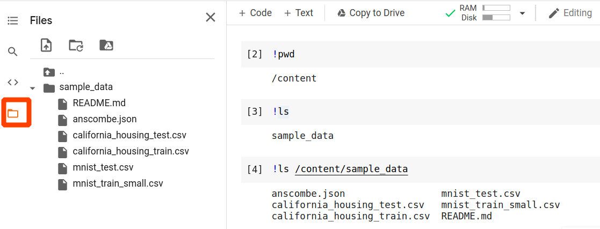
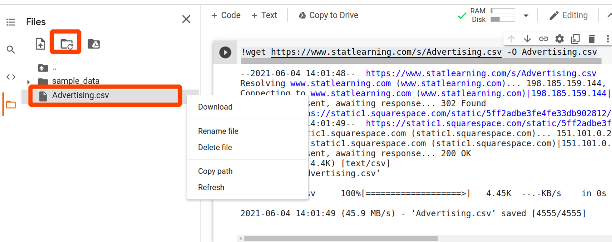
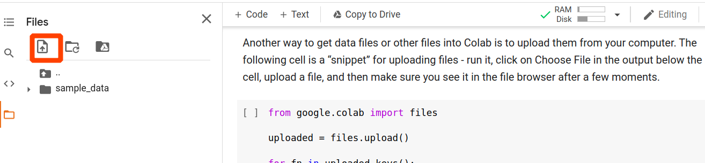
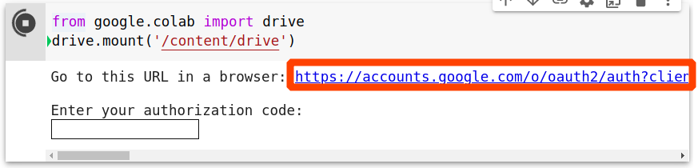
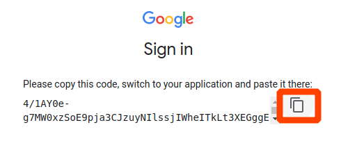
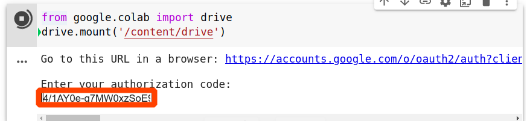
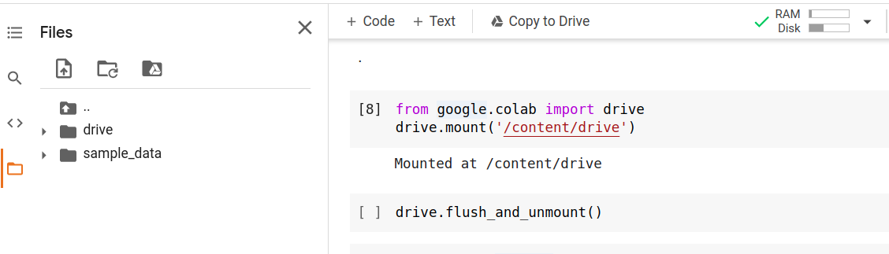

::: {.cell .markdown}

# Colab tour

_Fraida Fund_

[](https://colab.research.google.com/github/ffund/ml-notebooks/blob/master/notebooks/1-colab-tour.ipynb)

:::

::: {.cell .markdown}

### Attribution

* Parts of this notebook are from Google's own [Overview of Colab features](https://colab.research.google.com/notebooks/basic_features_overview.ipynb).
* Parts of this notebook are from the [I/O example notebook](https://colab.research.google.com/notebooks/io.ipynb) 

:::


::: {.cell .markdown}

## Introduction

Colaboratory - "Colab" for short - is a web application that lets you develop Python code in a "notebook" format, directly in your browser. 

It is especially well suited for machine learning, because:

* It provides free access to GPUs, which will be very helpful later in the course when we are working with neural networks. (There are some limits to this free access, however.)
* It has many of the most popular machine learning libraries already pre-installed, and you can manually install any other libraries you might need (for example, for your project).
* It is easy to share Colab notebooks with others.

All of the lab assignments and demos in this course are designed to run on Colab. 

:::

::: {.cell .markdown}

This notebook is a "tour" of Colab. You won't necessarily use all the features demonstrated in this notebook right away, but they'll be helpful over the course of the semester. So, review this notebook once, then keep it handy to refer back to when needed!

:::


::: {.cell .markdown}

## Cell basics

:::

::: {.cell .markdown}

A notebook is a list of "cells". Each cell contains either text or executable code. 

:::


::: {.cell .markdown}

There are a few ways to create a new cell:

You can click on the +Code or +Text buttons near the top left of the Colab interface:


You can move your mouse near the bottom of any existing cell to see +Code and +Text buttons appear, then click on one of those:


Or you can use Insert > Code cell or Insert > Text cell from the menu bar.


:::

::: {.cell .markdown}

Double-click on any cell to edit the cell. 

To delete a cell, click on the trash icon that appears in the top right when you click on the cell:


Or, you can right-click on a cell and choose "Delete cell".


:::

::: {.cell .markdown}

### Text cells

Text cells can be used to explain your code, or to comment on the output.

Text cells are formatted using markdown syntax to add headers, lists, bold or italic text, etc. To learn more, see this [markdown
reference](https://colab.research.google.com/notebooks/markdown_guide.ipynb).

You can also add math to text cells using [LaTeX](http://www.latex-project.org/). Just place the statement within a pair of **\$** signs. For example, 

`$\sqrt{3x-1}+(1+x)^2$` 

is rendered as 

$\sqrt{3x-1}+(1+x)^2.$

:::

::: {.cell .markdown}

### Code cells

Your Python code will go in code cells. For example:

:::

::: {.cell .code}
``` {.python}
a = 10
a
```
:::

::: {.cell .markdown}

To run the code in the cell above, press the Play button that appears on the left side of the cell when you move your mouse over it. The output will appear immediately below the cell.

:::

::: {.cell .markdown}

Colab also has some extra features to help you write Python code. One helpful feature is autocompletion. For example, run the following cell, which assigns a value to the variable named `course_description`: 

:::

::: {.cell .code}
``` {.python}
course_description = "Intro to Machine Learning"
```
:::

::: {.cell .markdown}

Now, suppose you want to print the course description. In the next cell, start to type

```python
print(course_description)
```

:::

::: {.cell .code}
``` {.python}

```
:::

::: {.cell .markdown}

After you type the first few characters, you'll see a menu near your cursor that offers to auto-complete the name of the variable you used earlier. You can press Tab to accept the offer.


:::

::: {.cell .markdown}

You may also notice that Colab will show you documentation for a function immediately after you type the function name and open parentheses:


:::

::: {.cell .markdown}

Another interesting feature of Colab is that in addition to running Python code, you can also run commands on the underlying (Linux) operating system.

To run a command on the underlying operating system, just preface the Linux command with a `!`. For example, try to run the [`pwd` command](https://man7.org/linux/man-pages/man1/pwd.1.html), which will **p**rint the name of your **w**orking **d**irectory:

:::

::: {.cell .code}
``` {.python}
!pwd
```
:::

::: {.cell .markdown}

### Running code cells

:::

::: {.cell .markdown}

You can run code cells one at a time, or run cells in groups.

To run a single code cell, press the Play button that appears on the left side of the cell when you move your mouse over it:


Try to run the following cell. The output of the code will appear below the cell when it runs.

:::

::: {.cell .code}
``` {.python}
print("Hello world")
```
:::

::: {.cell .markdown}


You can also click on a cell (to make it the "focused" cell), then choose Runtime > Run the focused cell from the menu:


:::


::: {.cell .markdown}

As you can see, the runtime menu includes several other useful options. You can:

* Run all of the code cells in the entire notebook
* Run all of the code cells *before* the currently focused cell
* Run all of the code cells *after* the currently focused cell (including the currently focused cell)

These are especially helpful when you modify code. For example, suppose you have a notebook with:

* (Part 1) several cells that load in and prepare data
* (Part 2) several cells that prepare and train a machine learning model on this data
* (Part 3) several cells that evaluate and visualize the effectiveness of the model

and you have run the entire notebook, but are not satisfied with the results. So, you modify the training procedure in the middle part of the notebook. 

You don't have to re-run the cells that load in and prepare the data (Part 1), since those cells are not affected by the changes to the training procedure. But, you do need to re-run some of Part 2 and all of Part 3, so that you can train the model using the modified procedure and visualize the *new* results. In this case, you would select the cell you modified, and use Runtime > Run After to re-run that cell and all cells that follow.

One common mistake to be careful of: students sometimes modify the code in a cell, re-run that cell, but forget to re-run all the later cells that depend on the modified cell. 

:::

::: {.cell .markdown}

When you run a cell, a number will appear in the left side of the cell, indicating the order in which the cell was executed. For example, consider the following set of three cells:

:::

::: {.cell .code}
``` {.python}
message = "Hello world"
```
:::

::: {.cell .code}
``` {.python}
prefix = "Message:"
```
:::

::: {.cell .code}
``` {.python}
print(prefix, message)
```
:::

::: {.cell .markdown}

If you run those three cells in order, you would expect to see consecutive execution numbers, like this:


:::

::: {.cell .markdown}

Sometimes, you may have a cell that runs for a very long time, or is stuck, and needs to be interrupted. Use Runtime > Interrupt Execution to interrupt a running cell. 

Try it now - run the cell below, then interrupt it using the Runtime menu.

:::

::: {.cell .code}
``` {.python}
import time
print("Sleeping")
time.sleep(60) # sleep for a while; interrupt me!
print("Done Sleeping")
```
:::

::: {.cell .markdown}

## Filesystems


When using Colab for machine learning, we often need to get data into the Colab runtime's filesystem.  This section describes several ways to interact with the Colab filesystem, including three ways to get data into the filesystem:

* downloading a file from the Internet
* uploading a file from your computer
* storing a file in your Google Drive, and connecting your Drive to your Colab session

:::

::: {.cell .markdown}

When you run a Colab notebook, your "working directory" - the directory from which your code executes - is, by default, `/content`. This directory will contain a `sample_data` subdirectory.

:::

::: {.cell .markdown}

On the side of the Colab interface, you'll see a folder icon. You can click on this icon to open a file explorer, where you can point and click to navigate the filesystem.



:::

::: {.cell .markdown}

If you are familiar with standard Linux commands for navigating a filesystem - `ls`, `cd`, `mv`, `pwd` - you can also use those commands in code cells, prefaced with a `!` as shown above.

:::

::: {.cell .markdown}

### Downloading a file

One way to get data into the Colab filesystem is to download it from the Internet using the Linux command `wget`. Pass the URL of the file you want to download as an argument to `wget`. You can optionally specify the name of the output file using the `-O` argument. For example:

:::


::: {.cell .code}
``` {.python}
!wget https://www.statlearning.com/s/Advertising.csv -O Advertising.csv
```
:::

::: {.cell .markdown}

After a brief delay, you should see the `Advertising.csv` file in the file explorer. (You can click the "Refresh" button, shown highlighted in red below, to update your view.) You can expand the file menu to interact with the file, to download it, rename it, or delete it.




:::


::: {.cell .markdown}

### Uploading a file

Another way to get data files or other files into Colab is to upload them from your computer. The following cell is a "snippet" for uploading files - run it, click on Choose File in the output below the cell, upload a file, and then make sure you see it in the file browser after a few moments.

:::

::: {.cell .code}
``` {.python}
from google.colab import files

uploaded = files.upload()

for fn in uploaded.keys():
  print('User uploaded file "{name}" with length {length} bytes'.format(
      name=fn, length=len(uploaded[fn])))
```
:::

::: {.cell .markdown}

You can also use the file explorer directly to upload files by clicking on the Upload button:




:::


::: {.cell .markdown}

### Mounting a Google Drive

Note that files downloaded from the Internet or uploaded from your computer are not *persistent* - they are deleted when your Colab session ends. 

Sometimes, it is useful to have a persistent file in your Colab session. For example, if you are working with a very large dataset, you may not want to download it or upload it each time you start a Colab session - this can take a long time! For *persistent* storage, you can save the file in your Google Drive, then *mount* your Google Drive in your Colab session to access the file from Colab.

:::


::: {.cell .markdown}

To mount your Google Drive in the Colab session, run the following cell:

:::

::: {.cell .code}
``` {.python}
from google.colab import drive
drive.mount('/content/drive')
```
:::


::: {.cell .markdown}

Click on the link in the output:



and sign in to the Google account that you want to connect.

Then, click the button to copy the authorization code:



Paste the code into the text input box in the cell output:



Then, hit Enter to connect your Google Drive. You should then see a `drive` directory, containing all of your Google Drive files and folders, in the file explorer:



Any changes you make to files in that folder - including modifying, adding, or deleting files - will be reflected in your Google Drive. Similarly, any changes you make to files in other Google Drive clients will be reflected in this Colab session. 

:::


::: {.cell .markdown}

To disconnect a Google Drive session from Colab, run the code in the following cell:

:::

::: {.cell .code}
``` {.python}
drive.flush_and_unmount()
```
:::

::: {.cell .markdown}

## Runtimes - under the hood

How does this all work? When you use Colab, a virtual machine is allocated especially for your use. This virtual machine includes:

* a compute resource - CPU or GPU
* a disk, with an operating system and key software (including Python and many data science/machine learning libraries) preinstalled
* RAM

You can do anything you need to do on this VM (including downloading files, installing software, and of course, running Python code) for as long as the VM is allocated to you. 

:::


::: {.cell .markdown}

### Runtime types

Colab comes with three "types" of runtimes:

* no hardware acceleration (i.e. CPU)
* GPU
* TPU

However, because GPU and TPU resources are relatively scarce, there are stricter limits imposed on their use. Therefore, you should use a CPU notebook unless you are doing something that benefits from hardware acceleration. If you overuse GPU runtimes when you don't really need them, Colab will prevent you from using GPU runtimes when you *do* use them! 

:::

::: {.cell .markdown}

To check what runtime type you are using, or to change the runtime type, click on Runtime > Change Runtime Type in the Colab menu. For a CPU runtime, make sure Hardware Acceleration is set to None. Then, choose Save.

**Note**: When you change the runtime type, it restarts the runtime, which means that any variables etc. saved in memory will be gone. So it's a good idea to set up your runtime *before* you start running any code in the notebook.

:::

::: {.cell .markdown}

Once you have set or confirmed your desired runtime type, you can connect to a runtime. "Connecting to a runtime" means that you ask Colab to allocate a virtual machine (of the desired type) to you, and connect it to your session.

There are two ways to connect to a runtime:

* Run any code cell - this will automatically connect your session to a runtime, if you are not already connected. (If you have already run the code cells above, your session is connected to a runtime!)
* Click the Connect button near the top right part of the Colab interface.


:::

::: {.cell .markdown}

### Resource limits

Colab is free to use, but several limitations apply to your usage:

* overall usage - there is a limit to how much Colab compute time you can use per day or per week, especially if you are using GPU. If you exceed this limit, you won't be able to use Colab for a short "cooling off" period.
* maximum VM lifetime - there is a limit to how long you can keep an allocated runtime. After this limit is exceeded, you will be disconnected from the runtime, and the virtual machine will be recyled.
* idle timeout period - there is a limit to how long your session will stay connected to a runtime if you are not actively using it. After this limit is exceeded, you will be disconnected from the runtime. Depending on the circumstances, it may be recyled, or you may be able to re-connect to the same runtime.
* GPU availability - GPU availability is not guaranteed, and you may not be able to access a GPU runtime on demand (especially if you have a lot of recent GPU usage).


:::

::: {.cell .markdown}

The lab assignments and demos in this course are designed carefully to avoid bumping up against these limitations, so that you can use Colab throughout the semester!

But, this applies only if you:

* don't use GPU resources when not necessary.
* close your Colab tabs when you are done working.

:::


::: {.cell .markdown}

In addition to the limits mentioned above, each Colab VM has some disk space and RAM allocated to it. 

Once you are connected to a runtime, you will see a bar graph in this space that shows you your current RAM and disk space usage. If you move your mouse over this bar graph, it will also show you your exact RAM and disk space usage, and the limits of your virtual machine.


:::

::: {.cell .markdown}

As mentioned above, despite the resource limits, Colab will be sufficient for all of the demos and homework assignments we will use in this course. In the fall, when you work on your project, we can discuss strategies including:

* modifying your project scope
* setting up your code to work well despite the resource limits (for example, training your model in small steps, and saving the weights to your Google Drive at each step in case the runtime is recycled)
* connecting your Colab session to a local runtime on your PC or one on a Google Cloud Platform compute instance (with free credits)
* using NYU's High Performance Computing resources instead

These resources will be available to you at no charge - you should not pay for compute resources for this course.

:::
